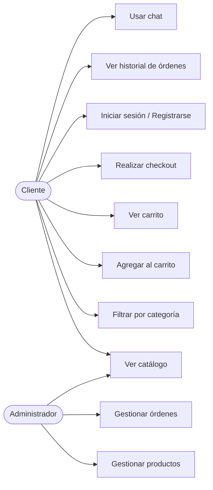
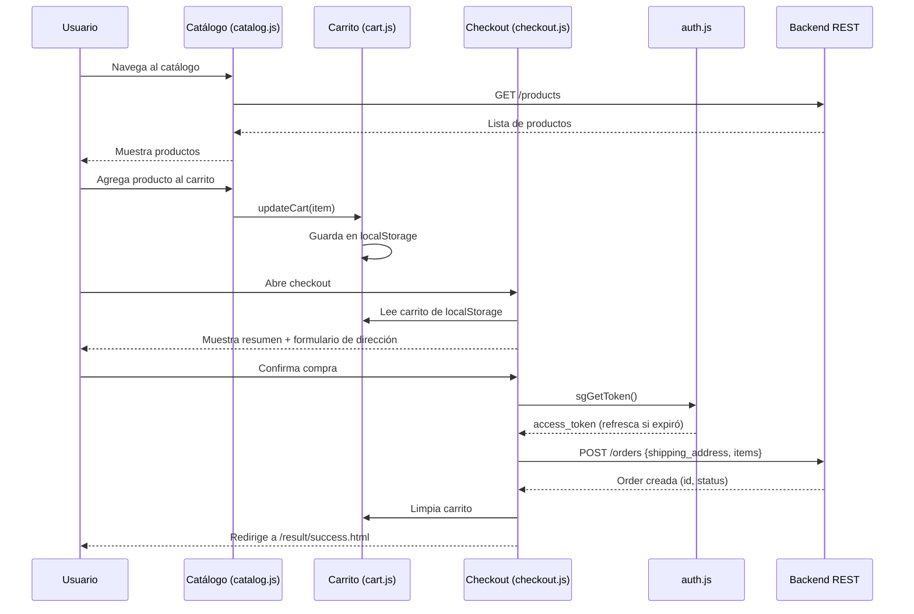
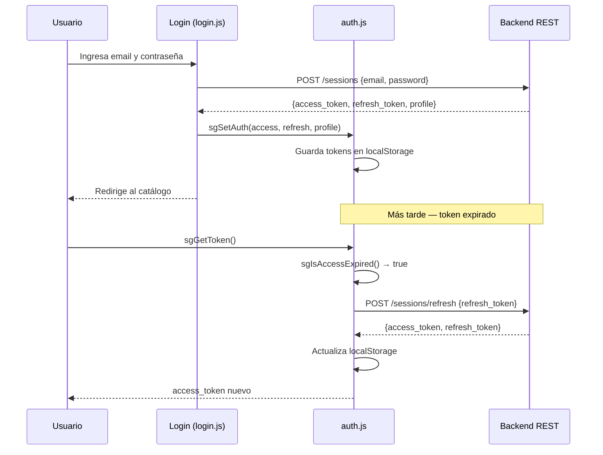
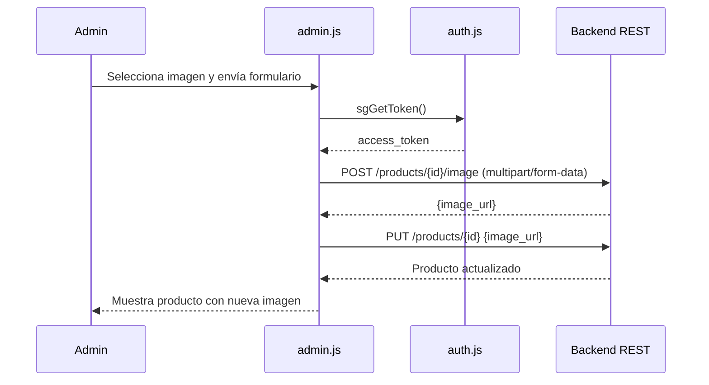
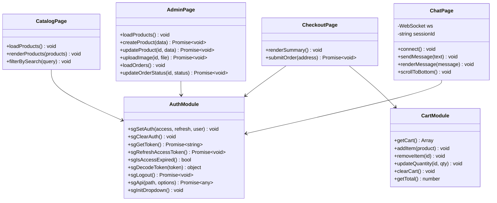

# Frontend — E-commerce de Vinilos

Interfaz web en **HTML, CSS y JavaScript vanilla** sin frameworks ni bundlers. Se comunica con el backend via REST y WebSocket.

---

## Tecnologías

| Tecnología | Uso |
|---|---|
| HTML5 | Estructura de páginas |
| CSS3 | Estilos y diseño responsivo |
| JavaScript (ES6+) | Lógica del cliente |
| Fetch API | Llamadas REST al backend |
| WebSocket API | Chat en tiempo real |
| localStorage | Carrito, tokens y sesión de chat |

---

## Estructura de carpetas

```
frontend/
├── auth.js              # Utilidades globales: tokens, fetch autenticado, dropdown
├── styles.css           # Estilos globales compartidos
├── home/                # Página de inicio
├── login/               # Login y registro
├── catalog/             # Catálogo general de vinilos
├── categories/          # Páginas por género musical (19 géneros)
├── cart/                # Carrito de compras
├── checkout/            # Formulario de checkout
├── orders/              # Historial de órdenes
├── chat/                # Chat con asistente
├── admin/               # Panel de administración
├── result/              # Página de resultado de compra
└── media/               # Imágenes: logo, hero, categorías, productos
```

---

## Páginas

| Página | Archivo | Descripción |
|---|---|---|
| Inicio | `home/index.html` | Landing con hero y acceso a categorías |
| Login | `login/login.html` | Login y registro de usuario |
| Catálogo | `catalog/catalog.html` | Todos los productos con búsqueda |
| Categoría | `categories/*.html` | Productos por género (rock, jazz, metal…) |
| Carrito | `cart/cart.html` | Resumen del carrito y acceso a checkout |
| Checkout | `checkout/checkout.html` | Dirección de envío y confirmación |
| Órdenes | `orders/orders.html` | Historial de compras del usuario |
| Chat | `chat/chat.html` | Chat en tiempo real con asistente automático |
| Admin | `admin/admin.html` | Gestión de productos y órdenes (admin) |
| Resultado | `result/success.html` | Confirmación de compra exitosa |

---

## Módulo de autenticación (auth.js)

`auth.js` es el módulo central compartido por todas las páginas. Provee:

- Almacenamiento de tokens en `localStorage`
- Decodificación de JWT sin librería
- Refresco automático de `access_token` cuando expira
- Wrapper de `fetch` con inyección de token y manejo de errores
- Dropdown de usuario con acceso a perfil, compras y panel admin

### Claves en localStorage

| Clave | Contenido |
|---|---|
| `sg_access_token` | JWT de acceso |
| `sg_refresh_token` | JWT de refresco |
| `sg_access_exp` | Timestamp de expiración (ms) |
| `sg_auth_user` | JSON con id, nombre, email, rol |

---

## Carrito

El carrito vive completamente en `localStorage` como un array de ítems:

```json
[
  { "id": "uuid", "name": "Nombre del vinilo", "price_cents": 3500, "quantity": 2, "image_url": "..." }
]
```

El checkout lo convierte a una orden via `POST /orders`.

---

## Chat WebSocket

```
ws://localhost:8000/realtime/chat?session_id=<id>
```

- El `session_id` se persiste en `localStorage` con la clave `sg_chat_session_id`.
- Al conectar, el servidor responde con `{type: "session", session_id}`.
- Los mensajes llegan como `{type: "message", message: {sender, content, ...}}`.

---

## Diagrama de casos de uso — Frontend



---

## Diagrama de secuencia — Flujo completo de compra



---

## Diagrama de secuencia — Login y autenticación



---

## Diagrama de secuencia — Subida de imagen de producto (admin)



---

## Diagrama de clases — Frontend



---

## Diagrama de componentes — Comunicación Frontend ↔ Backend

```mermaid
graph TD
    subgraph Frontend
        F1[auth.js]
        F2[catalog.js]
        F3[cart.js / checkout.js]
        F4[admin.js]
        F5[chat.js]
        F6[orders.js]
    end

    subgraph Backend REST
        B1[/products]
        B2[/sessions + /profiles]
        B3[/orders]
        B4[/media — imágenes]
    end

    subgraph Backend WebSocket
        W1[/realtime/chat]
    end

    subgraph Almacenamiento local
        LS[localStorage: carrito, tokens, session_id]
    end

    F2 -->|GET /products| B1
    F4 -->|POST/PUT/DELETE /products| B1
    F4 -->|POST /products/id/image| B4
    F1 -->|POST /sessions, /sessions/refresh| B2
    F3 -->|POST /orders| B3
    F6 -->|GET /orders| B3
    F5 -->|WS connect| W1
    F3 <--> LS
    F1 <--> LS
    F5 <--> LS
```

---

## Géneros musicales disponibles

El catálogo organiza los vinilos en 19 categorías:

Banda · Boleros · Corridos · General · Grunge · Hip-Hop · Jazz · Mariachi · Metal · Pop · Post-Punk · Psycho · Rap · Reggae · Relax · Rock en Español · Rock en Inglés · R&B · Trance · Trap

---

## Notas

- No requiere instalación ni bundler: ábrelo directamente en el navegador o con un servidor estático.
- La URL del backend está en cada archivo JS (`http://localhost:8000`). Cámbiala según el entorno.
- El carrito persiste en `localStorage` y no requiere login hasta el checkout.
- El panel admin solo es accesible a usuarios con rol `admin`.
